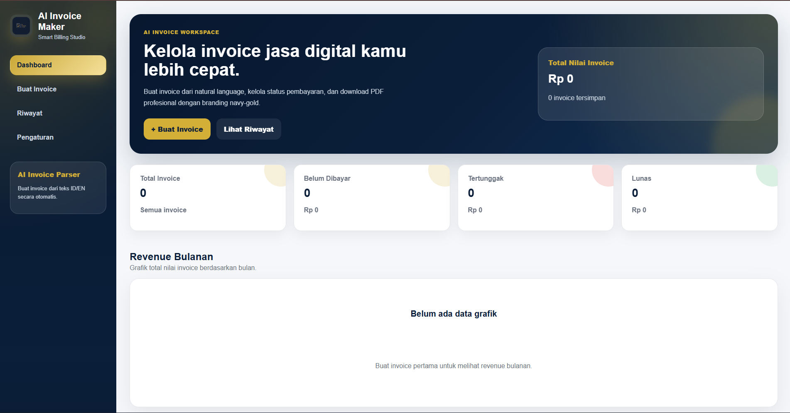
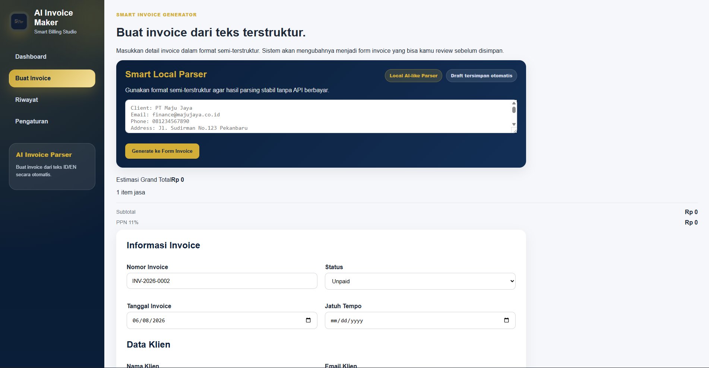
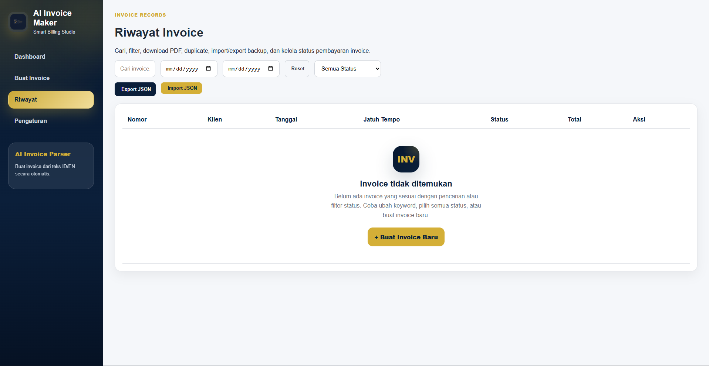
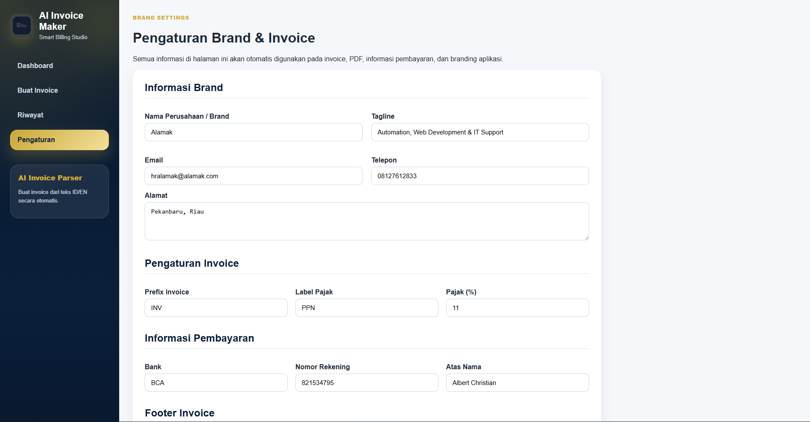

# AI Invoice Maker

AI Invoice Maker adalah aplikasi web invoice modern untuk jasa automation, web development, dan IT support. Aplikasi ini membantu membuat invoice dari input manual maupun teks semi-terstruktur menggunakan Smart Local Parser, lalu menghasilkan invoice profesional dengan branding navy-gold.

## Preview

<table>
  <tr>
    <td width="50%">
      <h3>Dashboard</h3>
      
    </td>
    <td width="50%">
      <h3>Create Invoice</h3>
      
    </td>
  </tr>
  <tr>
    <td width="50%">
      <h3>Invoice History</h3>
      
    </td>
    <td width="50%">
      <h3>Settings</h3>
      
    </td>
  </tr>
</table>

## Fitur Utama

- Smart Local Parser untuk mengubah teks invoice menjadi data form
- Review dan edit invoice sebelum disimpan
- Auto-numbering invoice dengan format `INV-YYYY-NNNN`
- PPN 11% dan mata uang Rupiah
- Riwayat invoice dengan search, filter status, dan filter tanggal
- Download PDF invoice profesional
- Print-friendly invoice preview
- Edit invoice yang sudah tersimpan
- Duplicate invoice
- Delete invoice dengan modal konfirmasi
- Mark as Paid dari halaman detail
- Share invoice via WhatsApp message
- Dashboard statistik invoice
- Grafik revenue bulanan
- Export dan import backup JSON
- Auto-save draft invoice dan teks parser
- Pengaturan brand, pajak, pembayaran, dan footer invoice

## Tech Stack

- React
- Vite
- React Router DOM
- jsPDF
- Recharts
- React Hot Toast
- LocalStorage

## Struktur Fitur

### Dashboard

Dashboard menampilkan ringkasan invoice, total nilai invoice, status pembayaran, invoice terbaru, dan grafik revenue bulanan.

### Buat Invoice

Halaman pembuatan invoice menyediakan dua cara input:

1. Input manual melalui form
2. Input teks semi-terstruktur melalui Smart Local Parser

Contoh format parser:

```txt
Client: PT Maju Jaya
Email: finance@majujaya.co.id
Phone: 081234567890
Address: Jl. Sudirman No.123 Pekanbaru

Items:
- Website Company Profile | 3500000
- Maintenance Bulanan | 750000

Due: 7 days
```

Parser akan mengisi data klien, item jasa, due date, status, dan catatan invoice secara otomatis.

### Riwayat Invoice

Halaman riwayat mendukung:

- Search berdasarkan nomor invoice, nama klien, atau status
- Filter status invoice
- Filter tanggal invoice
- Download PDF
- Detail invoice
- Edit invoice
- Duplicate invoice
- Delete invoice
- Export backup JSON
- Import backup JSON

### Detail Invoice

Halaman detail menyediakan preview invoice dengan tampilan profesional. User dapat:

- Download PDF
- Print invoice
- Kirim pesan WhatsApp
- Tandai invoice sebagai Paid
- Edit invoice

### Pengaturan

Data pengaturan digunakan secara dinamis pada invoice dan PDF.

Pengaturan yang tersedia:

- Nama perusahaan / brand
- Tagline
- Alamat
- Email
- Telepon
- Prefix invoice
- Label pajak
- Persentase pajak
- Informasi bank
- Nomor rekening
- Atas nama rekening
- Catatan footer invoice

## Instalasi

Clone repository:

```bash
git clone https://github.com/username/invoice-ai-maker.git
cd invoice-ai-maker
```

Install dependencies:

```bash
npm install
```

Jalankan development server:

```bash
npm run dev
```

Buka di browser:

```bash
http://localhost:5173
```

## Build Production

```bash
npm run build
```

Preview hasil build:

```bash
npm run preview
```

## Script NPM

```bash
npm run dev
```

Menjalankan aplikasi dalam mode development.

```bash
npm run build
```

Membuat build production.

```bash
npm run preview
```

Menjalankan preview hasil build.

```bash
npm run lint
```

Menjalankan pengecekan linting.

## Penyimpanan Data

Aplikasi ini menggunakan `localStorage`, sehingga data invoice tersimpan di browser pengguna.

Data yang disimpan:

- Settings brand
- Riwayat invoice
- Draft invoice
- Draft teks parser

Karena masih menggunakan localStorage, data belum tersinkronisasi antar perangkat dan belum memiliki autentikasi user.

## Backup dan Restore

Aplikasi menyediakan fitur export dan import JSON agar data invoice dapat dicadangkan dan dipulihkan.

Export menghasilkan file:

```txt
invoice-backup-YYYY-MM-DD.json
```

Import JSON akan mengganti data invoice dan pengaturan yang sedang tersimpan di browser.

## Format Nomor Invoice

Format default invoice:

```txt
INV-YYYY-NNNN
```

Contoh:

```txt
INV-2026-0001
```

Prefix invoice dapat diubah melalui halaman Pengaturan.

## Pajak

Pajak default:

```txt
PPN 11%
```

Label dan persentase pajak dapat diubah melalui halaman Pengaturan.

## Status Invoice

Status yang tersedia:

- Draft
- Unpaid
- Paid
- Overdue

Invoice dengan status `Unpaid` dan due date yang sudah lewat akan otomatis berubah menjadi `Overdue`.

## Catatan Pengembangan

Aplikasi ini sebelumnya dirancang dengan opsi AI API parser, tetapi versi saat ini menggunakan Smart Local Parser agar tetap gratis, stabil, dan dapat dijalankan tanpa API key.

Ke depannya aplikasi dapat dikembangkan dengan:

- Backend database
- Login user
- Sinkronisasi cloud
- Multi-company profile
- Email invoice langsung ke klien
- Payment tracking
- Integrasi AI API asli
- Deploy production dengan domain custom

## Author

**Albert Christian**

Mahasiswa Politeknik Caltex Riau  
Project untuk invoice maker jasa automation, web development, dan IT support.

## License

Project ini dibuat untuk kebutuhan pembelajaran dan pengembangan portofolio.
